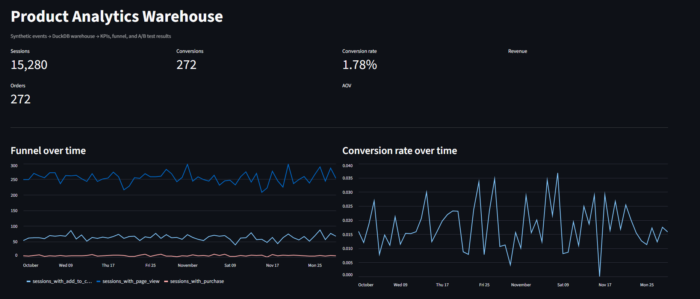
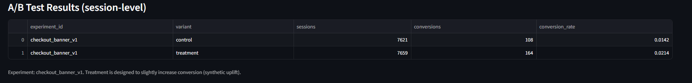

# Product Analytics Warehouse (SQL-first)

End-to-end product analytics project that generates realistic event data, loads it into a local DuckDB “warehouse,” builds SQL-first marts (sessions, funnel, daily KPIs), and surfaces results in a Streamlit dashboard including A/B test outcomes.

---

## What this project does

- Generates synthetic product data (users, sessions, events, orders)
- Loads raw CSVs into DuckDB (`raw_*` tables)
- Builds analytics-ready marts:
  - `fct_events`, `fct_sessions`, `fct_orders`
  - `fct_funnel_daily`, `kpi_daily`
  - `ab_results` (control vs treatment conversion)
- Visualizes KPIs, funnel trends, and A/B results in Streamlit

---

## Tech Stack

- Python (pandas)
- DuckDB (local analytics warehouse)
- SQL-first marts (DuckDB SQL)
- Streamlit (dashboard)
- SciPy (A/B test stats script, optional)

---

## Project Structure

product-analytics-warehouse/
├─ app/
│  └─ dashboard.py
├─ src/
│  ├─ generate/
│  │  └─ make_data.py
│  ├─ ingest/
│  │  └─ load_raw.py
│  ├─ marts/
│  │  └─ build_marts.py
│  └─ analysis/
│     └─ ab_test_stats.py
├─ data/
│  └─ raw/                 # gitignored (generated locally)
├─ warehouse/
│  └─ analytics.duckdb     # gitignored (created locally)
└─ requirements.txt


---

## Screenshots




## Setup (Windows PowerShell)

```powershell
py -m venv .venv
.\.venv\Scripts\Activate.ps1
python -m pip install --upgrade pip
python -m pip install -r requirements.txt
